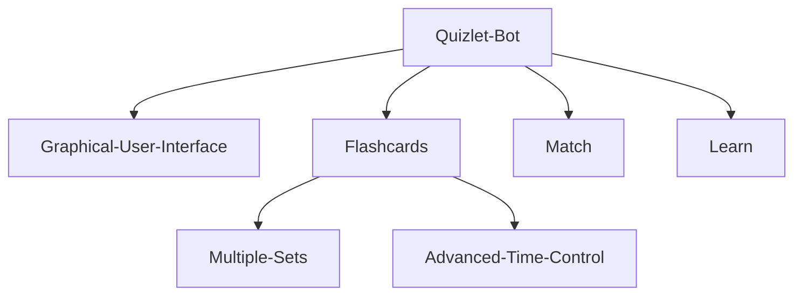

<div>
<a name="readme-top"></a>

[![Contributors][contributors-shield]][contributors-url]
[![Forks][forks-shield]][forks-url]
[![Stargazers][stars-shield]][stars-url]
[![Issues][issues-shield]][issues-url]
[![BSD-3-CLAUSE License][license-shield]][license-url]

<br />
<h3 align="center">Quizlet bot</h3>
  <p align="center">
    A python selenium bot
    <br />
    <a href="https://github.com/arozx/quizlet_bot"><strong>Explore the docs »</strong></a>
    <br />
    <a href="https://github.com/arozx/quizlet_bot/issues">Report Bug</a>
    ·
    <a href="https://github.com/arozx/quizlet_bot/issues">Request Feature</a>
  </p>
</div>


<details>
  <summary>Table of Contents</summary>
  <ol>
    <li>
      <a href="#about-the-project">About The Project</a>
    </li>
    <li>
      <a href="#getting-started">Getting Started</a>
      <ul>
        <li><a href="#prerequisites">Prerequisites</a></li>
        <li><a href="#installation">Installation</a></li>
      </ul>
    </li>
    <li><a href="#usage">Usage</a></li>
    <li><a href="#roadmap">Roadmap</a></li>
    <li><a href="#license">License</a></li>
    <li><a href="#contact">Contact</a></li>
  </ol>
</details>

<!-- ABOUT THE PROJECT -->
## About The Project

This project intends to automate the usage of the web app quizlet. Though all modes are not supported currently, once complete the project will contain more features.

<p align="right">(<a href="#readme-top">back to top</a>)</p>


<!-- GETTING STARTED -->
## Getting Started


### Prerequisites


### Installation

Clone the github repo by running

```sh
git clone https://arozx/quizlet_bot.git
```

You **MUST** change line 18 in [bot.py](bot.py) to match the location of the selenium driver executable.

<p align="right">(<a href="#readme-top">back to top</a>)</p>

<!-- USAGE -->
## Usage

To run the program use the following comand with the options noted below.

```sh
python quizlet_bot/bot.py -url -u -p -t
```

-url = flashcards **full** url

-u = Quizlet username

-p = Quizlet password

-t = Time in minutes

<p align="right">(<a href="#readme-top">back to top</a>)</p>


<!-- ROADMAP -->
## Roadmap



See the [open issues](https://github.com/arozx/quizlet_bot/issues) for a full list of proposed features (and known issues).

<p align="right">(<a href="#readme-top">back to top</a>)</p>

<!-- LICENSE -->
## License

Distributed under the BSD-3-CLAUSE License. See `LICENSE` for more information.


<!-- CONTACT -->
## Contact

Twitter - [@arozx_](https://twitter.com/arozx_) - 

Email - github@arozx.tech

Project Link: [https://github.com/arozx/quizlet_bot](https://github.com/arozx/quizlet_bot)

<p align="right">(<a href="#readme-top">back to top</a>)</p>


<!-- MARKDOWN LINKS & IMAGES -->
[contributors-shield]: https://img.shields.io/github/contributors/arozx/quizlet_bot.svg?style=for-the-badge
[contributors-url]: https://github.com/arozx/quizlet_bot/graphs/contributors
[forks-shield]: https://img.shields.io/github/forks/arozx/quizlet_bot.svg?style=for-the-badge
[forks-url]: https://github.com/arozx/quizlet_bot/network/members
[stars-shield]: https://img.shields.io/github/stars/arozx/quizlet_bot.svg?style=for-the-badge
[stars-url]: https://github.com/arozx/quizlet_bot/stargazers
[issues-shield]: https://img.shields.io/github/issues/arozx/quizlet_bot.svg?style=for-the-badge
[issues-url]: https://github.com/arozx/quizlet_bot/issues
[license-shield]: https://img.shields.io/github/license/arozx/quizlet_bot.svg?style=for-the-badge
[license-url]: https://github.com/arozx/quizlet_bot/blob/master/LICENSE