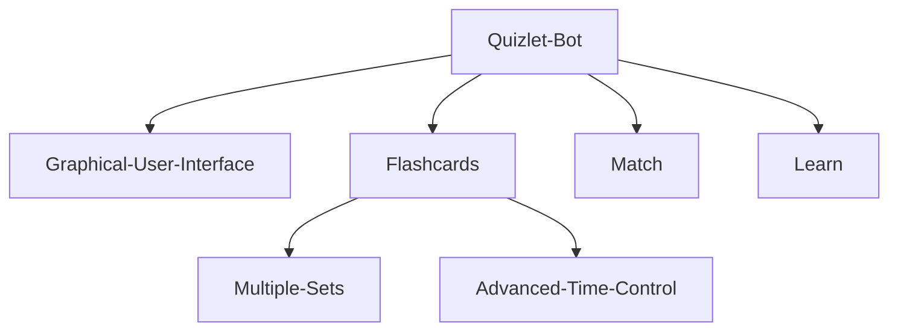

<h2 align="center">A Selenium Quizlet Bot</h2>

<p align="center">
<a href="https://github.com/arozx/quizlet_bot/blob/main/LICENSE"></a>
<a href="https://github.com/psf/black"></a>
</p>

---

# Installation and usage

## Installation

You need to have _python3_, _selenium_, if you are **NOT** using firefox you must change line 21 in in the bot to:
```python
driver = webdriver."your webrowser here"()
```
_The bot's_ python dependancies can be installed by running `pip install -r requirements.txt`.

## Usage

### Linux

You **MUST** change line 18 in [linux_bot.py](linux_bot.py) to match the location of the selenium driver

```sh
python3 quizlet_bot/linux_bot.py -url -u -p -t
```

-url = flashcards **_full_** url

-u = Quizlet Username

-p = Quizlet Password

-t = Time in minutes

---

### Windows

```sh
python3 quizlet_bot/windows_bot.py -url -u -p -t
```

-url = flashcards **_full_** url

-u = Quizlet username

-p = Quizlet password

-t = Time in minutes

# Roadmap

<div align="center">


</div>